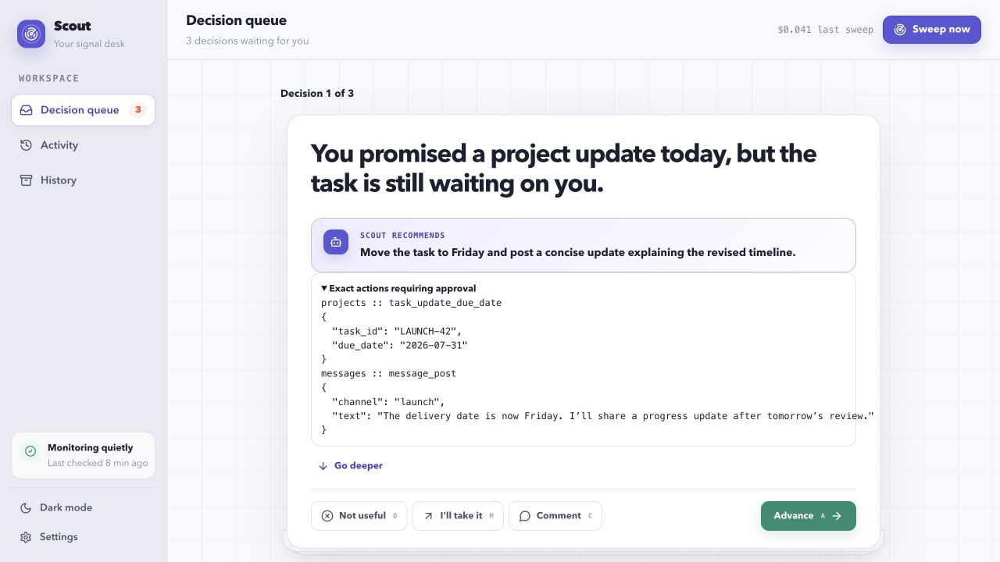
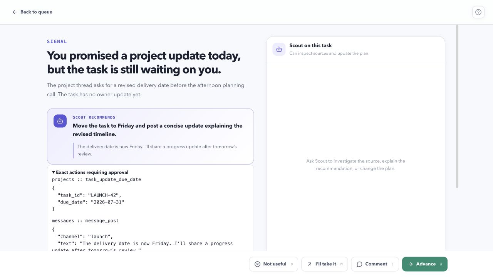
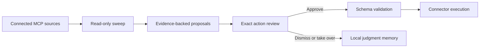

# Scout

[](https://github.com/oseiyoke/scout/actions/workflows/ci.yml)
[](LICENSE)

Scout is a local-first desktop assistant that turns scattered work signals into a calm decision queue. It reads sources you connect through MCP, identifies work that may need attention, and presents exact actions for review. It never performs an external write without explicit approval.



## Why Scout

- **One decision queue:** surface dropped commitments, replies, schedule conflicts, stale work, and follow-ups.
- **Inspect before acting:** every proposed write shows its connector, tool, and exact JSON arguments.
- **Approval-bound execution:** approval captures an immutable plan and validates it against the connector's current schema immediately before execution.
- **Bring your own tools:** connect curated providers or any compatible remote Streamable HTTP MCP endpoint.
- **Local-first controls:** credentials live in the operating system vault; browser sweeps and diagnostic retention are opt-in.
- **Transparent reasoning:** inspect sweep activity, evidence, costs, and the source context behind each proposal.



## How it works



## Project status

Scout is early-stage software. Review proposed tool arguments carefully, use test accounts while evaluating connectors, and report security issues privately as described in [SECURITY.md](SECURITY.md).

## Build from source

Requirements: Node.js 24, stable Rust, and the platform prerequisites for Tauri 2.

```bash
cd scout-app
npm ci
npm run check
npm run tauri dev
```

Production builds use `npm run tauri build`. API keys and connector credentials are entered in the app and stored in the operating system credential vault; never place secrets in `VITE_*` variables because Vite embeds those values in frontend bundles.

Useful commands:

```bash
npm run check       # TypeScript and unit tests
npm run build       # Production frontend build
npm run tauri build # Native desktop bundle
```

The screenshot fixture is development-only. With the Vite server running, open `/?showcase=1` or `/?showcase=1&view=detail` to regenerate sanitized product images.

## Security and privacy

- Every write action displays the connector, tool, and JSON arguments before approval.
- Approval captures an immutable plan; execution validates the current tool and input schema again.
- Browser sweeps and diagnostic prompt retention are off by default.
- Remote custom MCP endpoints must use HTTPS; loopback HTTP is allowed for development.
- Local application history is stored in SQLite and is not encrypted by Scout. Credentials are stored separately in the OS credential vault.

See [PRIVACY.md](PRIVACY.md), [SECURITY.md](SECURITY.md), and [THIRD_PARTY_NOTICES.md](THIRD_PARTY_NOTICES.md).

## Contributing

Contributions are welcome under the [MIT License](LICENSE). Read [CONTRIBUTING.md](CONTRIBUTING.md) and the [Code of Conduct](CODE_OF_CONDUCT.md) before opening a pull request.

## License

Copyright © 2026 Obose. Released under the [MIT License](LICENSE).
